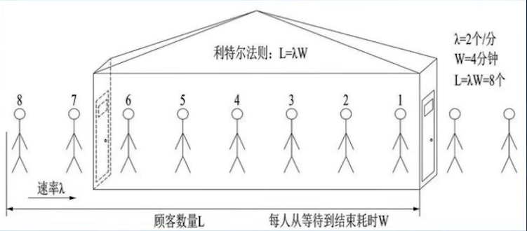

# 超时控制
* grpc http2 通过传输头携带超时时间 头部字段gprc-timeout
* 进程内context WithValue 

## 约定
* 95线超时时间
* 99线超时时间

# 过载保护
官方库:/x/time/rate
* 令牌桶算法
* 漏桶算法

缺点：需要显示传入指标,相对被动，更改反应慢

## 自适应的限流算法(被动丢弃流量)
利特尓法则:
</img>
[kratos V1 实现](https://github.com/go-kratos/kratos/blob/v1.0.x/pkg/ratelimit/bbr/bbr.go)

# 负载均衡
[代码](https://github.com/go-kratos/kratos/blob/v1.0.x/pkg/net/rpc/warden/balancer/p2c/p2c.go)